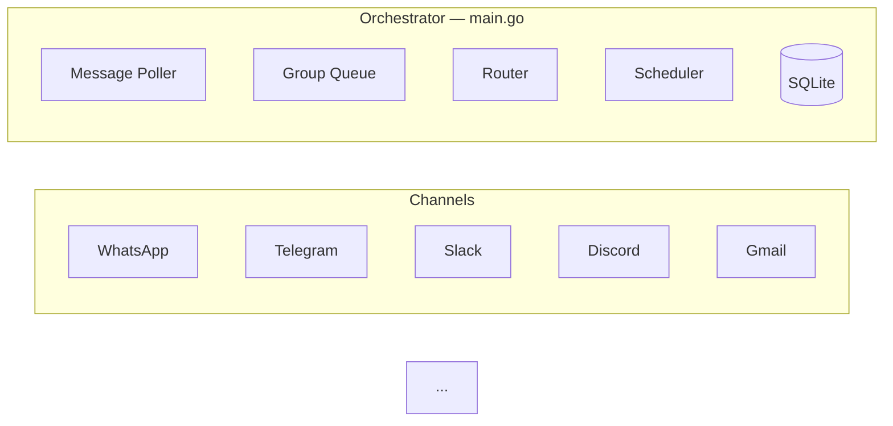

# NanoClaw Specification

A personal Claude assistant with multi-channel support, persistent memory per conversation, scheduled tasks, and container-isolated agent execution.

---

## Table of Contents

1. [Architecture](#architecture)
2. [Architecture: Channel System](#architecture-channel-system)
3. [Folder Structure](#folder-structure)
4. [Configuration](#configuration)
5. [Memory System](#memory-system)
6. [Session Management](#session-management)
7. [Message Flow](#message-flow)
8. [Commands](#commands)
9. [Scheduled Tasks](#scheduled-tasks)
10. [MCP Servers](#mcp-servers)
11. [Deployment](#deployment)
12. [Security Considerations](#security-considerations)

---

## Architecture

```
┌──────────────────────────────────────────────────────────────────────┐
│                        HOST (macOS / Linux)                           │
│                     (Main Go Process)                                 │
├──────────────────────────────────────────────────────────────────────┤
│                                                                       │
│  ┌──────────────────┐                  ┌────────────────────┐        │
│  │ Channels         │─────────────────▶│   SQLite Database  │        │
│  │ (self-register   │◀────────────────│   (messages.db)    │        │
│  │  at startup)     │  store/send      └─────────┬──────────┘        │
│  └──────────────────┘                            │                   │
│                                                   │                   │
│         ┌─────────────────────────────────────────┘                   │
│         │                                                             │
│         ▼                                                             │
│  ┌──────────────────┐    ┌──────────────────┐    ┌───────────────┐   │
│  │  Message Loop    │    │  Scheduler Loop  │    │  IPC Watcher  │   │
│  │  (polls SQLite)  │    │  (checks tasks)  │    │  (file-based) │   │
│  └────────┬─────────┘    └────────┬─────────┘    └───────────────┘   │
│           │                       │                                   │
│           └───────────┬───────────┘                                   │
│                       │ spawns container                              │
│                       ▼                                               │
├──────────────────────────────────────────────────────────────────────┤
│                     CONTAINER (Linux VM)                               │
├──────────────────────────────────────────────────────────────────────┤
...
```

### Technology Stack

| Component | Technology | Purpose |
|-----------|------------|---------|
| Channel System | Channel registry (`pkg/channel/registry.go`) | Channels self-register at startup |
| Message Storage | SQLite (go-sqlite3) | Store messages for polling |
| Container Runtime | Containers (Linux VMs) | Isolated environments for agent execution |
| Agent | @anthropic-ai/claude-agent-sdk | Run Claude with tools and MCP servers |
| Browser Automation | agent-browser + Chromium | Web interaction and screenshots |
| Runtime | Go 1.26+ | Host process for routing and scheduling |

---

## Architecture: Channel System

The core ships with built-in channels (WhatsApp, Telegram, Slack, Discord, Gmail). Channels self-register at startup; channels with missing credentials emit a WARN log and are skipped.

### System Diagram



### Channel Registry

The channel system is built on a factory registry in `pkg/channel/registry.go`:

```go
type ChannelFactory func(opts ChannelOpts) Channel

func RegisterChannel(name string, factory ChannelFactory)
func GetChannelFactory(name string) ChannelFactory
func GetRegisteredChannelNames() []string
```

Each factory receives `ChannelOpts` (callbacks for `OnMessage`, `OnChatMetadata`, and `RegisteredGroups`) and returns a `Channel` instance.

### Channel Interface

Every channel implements this interface (defined in `pkg/channel/types.go`):

```go
type Channel interface {
	Name() string
	Connect() error
	SendMessage(jid string, text string) error
	IsConnected() bool
	OwnsJID(jid string) bool
	Disconnect() error
}
```

Optional interfaces: `TypingChannel`, `SyncableChannel`.

### Self-Registration Pattern

Channels self-register using `init()` functions:

1. Each channel package (e.g. `pkg/channels/whatsapp`) calls `RegisterChannel()` in its `init()` function:

   ```go
   // pkg/channels/whatsapp/whatsapp.go
   func init() {
       channel.RegisterChannel("whatsapp", NewWhatsAppChannel)
   }
   ```

2. The orchestrator (`cmd/nanoclaw/main.go`) imports all channel packages, triggering registration:

   ```go
   import (
       _ "github.com/nanoclaw/nanoclaw/pkg/channels/whatsapp"
       _ "github.com/nanoclaw/nanoclaw/pkg/channels/telegram"
       // ...
   )
   ```

### Key Files

| File | Purpose |
|------|---------|
| `pkg/channel/registry.go` | Channel factory registry |
| `pkg/channel/types.go` | `Channel` interface, `ChannelOpts`, message types |
| `cmd/nanoclaw/main.go` | Orchestrator — instantiates channels, runs message loop |
| `pkg/router/router.go` | Finds the owning channel for a JID |
| `pkg/router/formatting.go` | Formats messages |

### Adding a New Channel

To add a new channel, contribute a skill to `.claude/skills/add-<name>/` that:

1. Adds a `src/channels/<name>.ts` file implementing the `Channel` interface
2. Calls `registerChannel(name, factory)` at module load
3. Returns `null` from the factory if credentials are missing
4. Adds an import line to `src/channels/index.ts`

See existing skills (`/add-whatsapp`, `/add-telegram`, `/add-slack`, `/add-discord`, `/add-gmail`) for the pattern.

---

## Folder Structure

```
nanoclaw/
├── CLAUDE.md                      # Project context for Claude Code
├── docs/
│   ├── SPEC.md                    # This specification document
│   ├── REQUIREMENTS.md            # Architecture decisions
│   └── SECURITY.md                # Security model
├── README.md                      # User documentation
├── Makefile                       # Go build/test/run tasks
├── go.mod                         # Go module definition
├── go.sum                         # Go dependency checksums
├── .gitignore
│
├── cmd/
│   ├── nanoclaw/
│   │   └── main.go                # Orchestrator: entry point, wiring
│   ├── setup/
│   │   └── main.go                # Setup CLI entry point
│   └── whatsapp-auth/
│       └── main.go                # Standalone WhatsApp authentication
│
├── pkg/
│   ├── channel/                   # Channel registry and base types
│   ├── channels/                  # Messaging platform implementations
│   ├── config/                    # Configuration and constants
│   ├── container/                 # Container runner and mount logic
│   ├── db/                        # SQLite storage layer
│   ├── env/                       # .env file reading
│   ├── ipc/                       # File-based IPC watcher
│   ├── logger/                    # Structured logging
│   ├── messagepoller/             # Message loop (polling SQLite)
│   ├── mount/                     # Mount allowlist validation
│   ├── proxy/                     # Credential proxy
│   ├── router/                    # Routing and formatting
│   ├── scheduler/                 # Task scheduler
│   ├── senderallowlist/           # Message dropping logic
│   ├── setup/                     # Setup step implementations
│   ├── taskqueue/                 # Per-group message queue
│   └── types/                     # Shared data structures
│
├── container/
│   ├── Dockerfile                 # Container image (runs as 'node' user, includes Claude Code CLI)
│   ├── build.sh                   # Build script for container image
│   ├── agent-runner/              # Code that runs inside the container
│   │   ├── package.json
│   │   ├── tsconfig.json
│   │   └── src/
│   │       ├── index.ts           # Entry point (query loop, IPC polling, session resume)
│   │       └── ipc-mcp-stdio.ts   # Stdio-based MCP server for host communication
│   └── skills/
│       └── agent-browser.md       # Browser automation skill
│
├── .claude/
│   └── skills/
│       ├── setup/SKILL.md              # /setup - First-time installation
│       ├── customize/SKILL.md          # /customize - Add capabilities
│       ├── debug/SKILL.md              # /debug - Container debugging
│       ├── add-telegram/SKILL.md       # /add-telegram - Telegram channel
│       ├── add-gmail/SKILL.md          # /add-gmail - Gmail integration
│       ├── add-voice-transcription/    # /add-voice-transcription - Whisper
│       ├── x-integration/SKILL.md      # /x-integration - X/Twitter
│       ├── convert-to-apple-container/  # /convert-to-apple-container - Apple Container runtime
│       └── add-parallel/SKILL.md       # /add-parallel - Parallel agents
...
```

---

## Configuration

Configuration constants are in `pkg/config/config.go`:

```go
var (
    AssistantName            = "Andy"
    PollInterval             = 2000
    SchedulerPollInterval    = 60000
    StoreDir                 = ""
    GroupsDir                = ""
    DataDir                  = ""
    ContainerImage           = "nanoclaw-agent:latest"
    ContainerTimeout         = 1800000
    IPCPollInterval          = 1000
    IdleTimeout              = 1800000
    MaxConcurrentContainers  = 5
    TriggerPattern           *regexp.Regexp
)
```

**Note:** Paths must be absolute for container volume mounts to work correctly.

### Container Configuration

Groups can have additional directories mounted via `containerConfig` in the SQLite `registered_groups` table (stored as JSON in the `container_config` column). Example registration:

```typescript
setRegisteredGroup("1234567890@g.us", {
  name: "Dev Team",
  folder: "whatsapp_dev-team",
  trigger: "@Andy",
  added_at: new Date().toISOString(),
  containerConfig: {
    additionalMounts: [
      {
        hostPath: "~/projects/webapp",
        containerPath: "webapp",
        readonly: false,
      },
    ],
    timeout: 600000,
  },
});
```

Folder names follow the convention `{channel}_{group-name}` (e.g., `whatsapp_family-chat`, `telegram_dev-team`). The main group has `isMain: true` set during registration.

Additional mounts appear at `/workspace/extra/{containerPath}` inside the container.

**Mount syntax note:** Read-write mounts use `-v host:container`, but readonly mounts require `--mount "type=bind,source=...,target=...,readonly"` (the `:ro` suffix may not work on all runtimes).

### Claude Authentication

Configure authentication in a `.env` file in the project root. Two options:

**Option 1: Claude Subscription (OAuth token)**
```bash
CLAUDE_CODE_OAUTH_TOKEN=sk-ant-oat01-...
```
The token can be extracted from `~/.claude/.credentials.json` if you're logged in to Claude Code.

**Option 2: Pay-per-use API Key**
```bash
ANTHROPIC_API_KEY=sk-ant-api03-...
```

Only the authentication variables (`CLAUDE_CODE_OAUTH_TOKEN` and `ANTHROPIC_API_KEY`) are extracted from `.env` and written to `data/env/env`, then mounted into the container at `/workspace/env-dir/env` and sourced by the entrypoint script. This ensures other environment variables in `.env` are not exposed to the agent. This workaround is needed because some container runtimes lose `-e` environment variables when using `-i` (interactive mode with piped stdin).

### Changing the Assistant Name

Set the `ASSISTANT_NAME` environment variable:

```bash
ASSISTANT_NAME=Bot npm start
```

Or edit the default in `src/config.ts`. This changes:
- The trigger pattern (messages must start with `@YourName`)
- The response prefix (`YourName:` added automatically)

### Placeholder Values in launchd

Files with `{{PLACEHOLDER}}` values need to be configured:
- `{{PROJECT_ROOT}}` - Absolute path to your nanoclaw installation
- `{{NODE_PATH}}` - Path to node binary (detected via `which node`)
- `{{HOME}}` - User's home directory

---

## Memory System

NanoClaw uses a hierarchical memory system based on CLAUDE.md files.

### Memory Hierarchy

| Level | Location | Read By | Written By | Purpose |
|-------|----------|---------|------------|---------|
| **Global** | `groups/CLAUDE.md` | All groups | Main only | Preferences, facts, context shared across all conversations |
| **Group** | `groups/{name}/CLAUDE.md` | That group | That group | Group-specific context, conversation memory |
| **Files** | `groups/{name}/*.md` | That group | That group | Notes, research, documents created during conversation |

### How Memory Works

1. **Agent Context Loading**
   - Agent runs with `cwd` set to `groups/{group-name}/`
   - Claude Agent SDK with `settingSources: ['project']` automatically loads:
     - `../CLAUDE.md` (parent directory = global memory)
     - `./CLAUDE.md` (current directory = group memory)

2. **Writing Memory**
   - When user says "remember this", agent writes to `./CLAUDE.md`
   - When user says "remember this globally" (main channel only), agent writes to `../CLAUDE.md`
   - Agent can create files like `notes.md`, `research.md` in the group folder

3. **Main Channel Privileges**
   - Only the "main" group (self-chat) can write to global memory
   - Main can manage registered groups and schedule tasks for any group
   - Main can configure additional directory mounts for any group
   - All groups have Bash access (safe because it runs inside container)

---

## Session Management

Sessions enable conversation continuity - Claude remembers what you talked about.

### How Sessions Work

1. Each group has a session ID stored in SQLite (`sessions` table, keyed by `group_folder`)
2. Session ID is passed to Claude Agent SDK's `resume` option
3. Claude continues the conversation with full context
4. Session transcripts are stored as JSONL files in `data/sessions/{group}/.claude/`

---

## Message Flow

### Incoming Message Flow

```
1. User sends a message via any connected channel
   │
   ▼
2. Channel receives message (e.g. Baileys for WhatsApp, Bot API for Telegram)
   │
   ▼
3. Message stored in SQLite (store/messages.db)
   │
   ▼
4. Message loop polls SQLite (every 2 seconds)
   │
   ▼
5. Router checks:
   ├── Is chat_jid in registered groups (SQLite)? → No: ignore
   └── Does message match trigger pattern? → No: store but don't process
   │
   ▼
6. Router catches up conversation:
   ├── Fetch all messages since last agent interaction
   ├── Format with timestamp and sender name
   └── Build prompt with full conversation context
   │
   ▼
7. Router invokes Claude Agent SDK:
   ├── cwd: groups/{group-name}/
   ├── prompt: conversation history + current message
   ├── resume: session_id (for continuity)
   └── mcpServers: nanoclaw (scheduler)
   │
   ▼
8. Claude processes message:
   ├── Reads CLAUDE.md files for context
   └── Uses tools as needed (search, email, etc.)
   │
   ▼
9. Router prefixes response with assistant name and sends via the owning channel
   │
   ▼
10. Router updates last agent timestamp and saves session ID
```

### Trigger Word Matching

Messages must start with the trigger pattern (default: `@Andy`):
- `@Andy what's the weather?` → ✅ Triggers Claude
- `@andy help me` → ✅ Triggers (case insensitive)
- `Hey @Andy` → ❌ Ignored (trigger not at start)
- `What's up?` → ❌ Ignored (no trigger)

### Conversation Catch-Up

When a triggered message arrives, the agent receives all messages since its last interaction in that chat. Each message is formatted with timestamp and sender name:

```
[Jan 31 2:32 PM] John: hey everyone, should we do pizza tonight?
[Jan 31 2:33 PM] Sarah: sounds good to me
[Jan 31 2:35 PM] John: @Andy what toppings do you recommend?
```

This allows the agent to understand the conversation context even if it wasn't mentioned in every message.

---

## Commands

### Commands Available in Any Group

| Command | Example | Effect |
|---------|---------|--------|
| `@Assistant [message]` | `@Andy what's the weather?` | Talk to Claude |

### Commands Available in Main Channel Only

| Command | Example | Effect |
|---------|---------|--------|
| `@Assistant add group "Name"` | `@Andy add group "Family Chat"` | Register a new group |
| `@Assistant remove group "Name"` | `@Andy remove group "Work Team"` | Unregister a group |
| `@Assistant list groups` | `@Andy list groups` | Show registered groups |
| `@Assistant remember [fact]` | `@Andy remember I prefer dark mode` | Add to global memory |

---

## Scheduled Tasks

NanoClaw has a built-in scheduler that runs tasks as full agents in their group's context.

### How Scheduling Works

1. **Group Context**: Tasks created in a group run with that group's working directory and memory
2. **Full Agent Capabilities**: Scheduled tasks have access to all tools (WebSearch, file operations, etc.)
3. **Optional Messaging**: Tasks can send messages to their group using the `send_message` tool, or complete silently
4. **Main Channel Privileges**: The main channel can schedule tasks for any group and view all tasks

### Schedule Types

| Type | Value Format | Example |
|------|--------------|---------|
| `cron` | Cron expression | `0 9 * * 1` (Mondays at 9am) |
| `interval` | Milliseconds | `3600000` (every hour) |
| `once` | ISO timestamp | `2024-12-25T09:00:00Z` |

### Creating a Task

```
User: @Andy remind me every Monday at 9am to review the weekly metrics

Claude: [calls mcp__nanoclaw__schedule_task]
        {
          "prompt": "Send a reminder to review weekly metrics. Be encouraging!",
          "schedule_type": "cron",
          "schedule_value": "0 9 * * 1"
        }

Claude: Done! I'll remind you every Monday at 9am.
```

### One-Time Tasks

```
User: @Andy at 5pm today, send me a summary of today's emails

Claude: [calls mcp__nanoclaw__schedule_task]
        {
          "prompt": "Search for today's emails, summarize the important ones, and send the summary to the group.",
          "schedule_type": "once",
          "schedule_value": "2024-01-31T17:00:00Z"
        }
```

### Managing Tasks

From any group:
- `@Andy list my scheduled tasks` - View tasks for this group
- `@Andy pause task [id]` - Pause a task
- `@Andy resume task [id]` - Resume a paused task
- `@Andy cancel task [id]` - Delete a task

From main channel:
- `@Andy list all tasks` - View tasks from all groups
- `@Andy schedule task for "Family Chat": [prompt]` - Schedule for another group

---

## MCP Servers

### NanoClaw MCP (built-in)

The `nanoclaw` MCP server is created dynamically per agent call with the current group's context.

**Available Tools:**
| Tool | Purpose |
|------|---------|
| `schedule_task` | Schedule a recurring or one-time task |
| `list_tasks` | Show tasks (group's tasks, or all if main) |
| `get_task` | Get task details and run history |
| `update_task` | Modify task prompt or schedule |
| `pause_task` | Pause a task |
| `resume_task` | Resume a paused task |
| `cancel_task` | Delete a task |
| `send_message` | Send a message to the group via its channel |

---

## Deployment

NanoClaw runs as a background service (launchd on macOS, systemd on Linux).

### Startup Sequence

When NanoClaw starts, it:
1. **Ensures container runtime is running**
2. Initializes the SQLite database
3. Loads state from SQLite
4. **Connects channels** — loops through registered channels, instantiates those with credentials, calls `Connect()` on each
5. Once channels are ready:
   - Starts the scheduler loop
   - Starts the IPC watcher
   - Sets up the per-group queue
   - Recovers any unprocessed messages
   - Starts the message polling loop

### Service: com.nanoclaw

**launchd/com.nanoclaw.plist:**
```xml
<?xml version="1.0" encoding="UTF-8"?>
<!DOCTYPE plist PUBLIC "-//Apple//DTD PLIST 1.0//EN" "...">
<plist version="1.0">
<dict>
    <key>Label</key>
    <string>com.nanoclaw</string>
    <key>ProgramArguments</key>
    <array>
        <string>/Users/robert/projects/github.com/nanoclaw/bin/nanoclaw</string>
    </array>
    <key>WorkingDirectory</key>
    <string>/Users/robert/projects/github.com/nanoclaw</string>
    <key>RunAtLoad</key>
    <true/>
    <key>KeepAlive</key>
    <true/>
    <key>EnvironmentVariables</key>
    <dict>
        <key>PATH</key>
        <string>{{HOME}}/.local/bin:/usr/local/bin:/usr/bin:/bin</string>
        <key>HOME</key>
        <string>{{HOME}}</string>
        <key>ASSISTANT_NAME</key>
        <string>Andy</string>
    </dict>
    <key>StandardOutPath</key>
    <string>{{PROJECT_ROOT}}/logs/nanoclaw.log</string>
    <key>StandardErrorPath</key>
    <string>{{PROJECT_ROOT}}/logs/nanoclaw.error.log</string>
</dict>
</plist>
```

### Managing the Service

```bash
# Install service
cp launchd/com.nanoclaw.plist ~/Library/LaunchAgents/

# Start service
launchctl load ~/Library/LaunchAgents/com.nanoclaw.plist

# Stop service
launchctl unload ~/Library/LaunchAgents/com.nanoclaw.plist

# Check status
launchctl list | grep nanoclaw

# View logs
tail -f logs/nanoclaw.log
```

---

## Security Considerations

### Container Isolation

All agents run inside containers (lightweight Linux VMs), providing:
- **Filesystem isolation**: Agents can only access mounted directories
- **Safe Bash access**: Commands run inside the container, not on your Mac
- **Network isolation**: Can be configured per-container if needed
- **Process isolation**: Container processes can't affect the host
- **Non-root user**: Container runs as unprivileged `node` user (uid 1000)

### Prompt Injection Risk

WhatsApp messages could contain malicious instructions attempting to manipulate Claude's behavior.

**Mitigations:**
- Container isolation limits blast radius
- Only registered groups are processed
- Trigger word required (reduces accidental processing)
- Agents can only access their group's mounted directories
- Main can configure additional directories per group
- Claude's built-in safety training

**Recommendations:**
- Only register trusted groups
- Review additional directory mounts carefully
- Review scheduled tasks periodically
- Monitor logs for unusual activity

### Credential Storage

| Credential | Storage Location | Notes |
|------------|------------------|-------|
| Claude CLI Auth | data/sessions/{group}/.claude/ | Per-group isolation, mounted to /home/node/.claude/ |
| WhatsApp Session | store/auth/ | Auto-created, persists ~20 days |

### File Permissions

The groups/ folder contains personal memory and should be protected:
```bash
chmod 700 groups/
```

---

## Troubleshooting

### Common Issues

| Issue | Cause | Solution |
|-------|-------|----------|
| No response to messages | Service not running | Check `launchctl list | grep nanoclaw` |
| "Claude Code process exited with code 1" | Container runtime failed to start | Check logs; NanoClaw auto-starts container runtime but may fail |
| "Claude Code process exited with code 1" | Session mount path wrong | Ensure mount is to `/home/node/.claude/` not `/root/.claude/` |
| Session not continuing | Session ID not saved | Check SQLite: `sqlite3 store/messages.db "SELECT * FROM sessions"` |
| Session not continuing | Mount path mismatch | Container user is `node` with HOME=/home/node; sessions must be at `/home/node/.claude/` |
| "QR code expired" | WhatsApp session expired | Delete store/auth/ and restart |
| "No groups registered" | Haven't added groups | Use `@Andy add group "Name"` in main |

### Log Location

- `logs/nanoclaw.log` - stdout
- `logs/nanoclaw.error.log` - stderr

### Debug Mode

Run manually for verbose output:
```bash
make run
```
